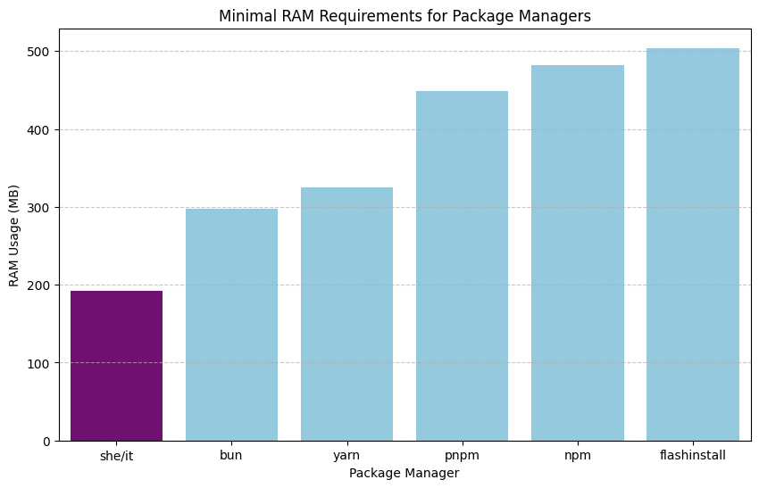

# install-node-modules

## Bench

first run `./build.sh <name>`
then run `./run.sh <number of megs>`

Minimal requirements:

0. **she/it (ours) - 192m RAM**
1. bun - 298m RAM
2. yarn - 325m RAM
3. pnpm - 449m RAM
4. npm - 482m RAM
5. flashinstall - 504m RAM

PS: i tested this on 8G VPS, so this is clean environment without any interference with the results.

## Other installers

[click](https://github.com/conaticus/click) did not work

[vold](https://github.com/suptejas/volt) support ended, did not work

[ied](https://github.com/alexanderGugel/ied) does not work with modern packages?

[caladan](https://github.com/healeycodes/caladan) would not compile

[boltpm](https://github.com/nom-nom-hub/boltpm) fetches localhost???

